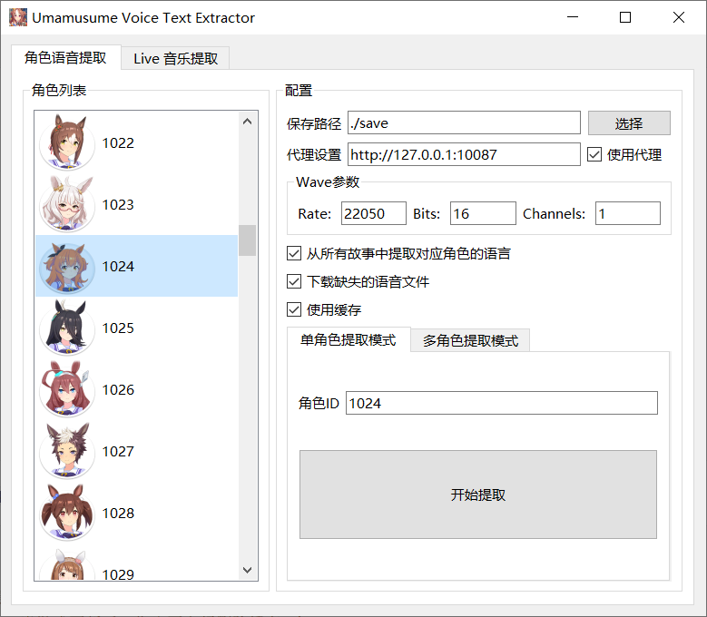
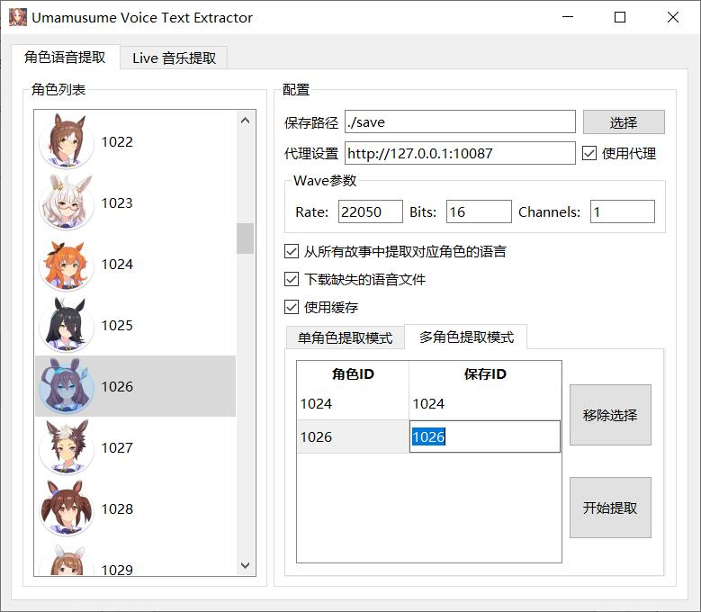
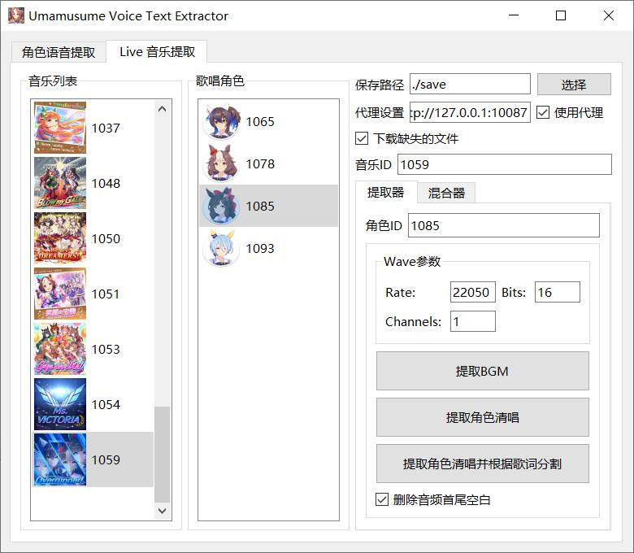

# umamusume-voice-text-extractor

- 提取语音和对应的文本
- GUI版目前正在测试，如果出现异常，请发 issue 或者使用 releases 中的稳定版。


# 使用方法

- 从 [Releases](https://github.com/chinosk6/umamusume-voice-text-extractor/releases) 下载二进制文件，或者:

- 需要环境: [Python 3.8+](https://www.python.org/downloads/)、[.Net 6.0 运行时](https://dotnet.microsoft.com/zh-cn/download/dotnet/6.0)
- 安装 Python 包: `pip install -r requirements.txt`

```
pydantic~=1.8.2
colorama~=0.4.4
pythonnet~=3.0.1
UnityPy~=1.9.21
requests~=2.28.1
tqdm
PyQt5~=5.15.4
```


## 使用GUI

- 直接运行 [Releases](https://github.com/chinosk6/umamusume-voice-text-extractor/releases) 压缩包内的二进制文件: `run.bat`
- 从源码运行: `python gui_main.py`


### 单角色提取

- 提取结果例: `xxx/xxx.wav|こんにちは`
- 操作说明: 点击目标角色，然后开始提取即可。<br>


### 多角色提取

- 提取结果例: `xxx/xxx.wav|0|こんにちは`
- 操作说明: 双击目标角色添加到列表, 可以自行修改`保存ID` 。<br>


### Live 音乐提取

- 操作方法: 点击目标音乐，然后点击目标角色即可。<br>


### Live 音乐混合

- 在目标角色上点击右键，添加到目标位置即可。大于 `歌唱角色位置数` 的部分将被忽略。<br>


## 无GUI

- 根据自己的需求修改 `main.py`, 然后运行: `python main.py`

```python
import voiceex

# 设置保存路径、当缺失文件时是否直接下载、从所有角色个人剧情中获取音频(耗时很长)、是否使用缓存(保存在"umacache"文件夹中。使用缓存可以极大提高语音文本读取速度。当游戏更新后，您需要自行删除缓存。)
ex = voiceex.VoiceEx(save_path="save", download_missing_voice_files=True, get_voice_from_all_stories=False, use_cache=True)

# 设置wav采样率, 位数, 声道数 (可选, 若不设置, 则以源文件参数输出)
ex.set_wav_format(22050, 16, 1)

# 设置下载代理 (可选, 若不需要, 直接注释掉即可)
ex.set_proxies("http://127.0.0.1:10087")
```

 - 单角色模式

```python
# 单角色模式
# 开始提取角色 No.1024 (摩耶重炮) 的语音/文本
ex.extract_all_char_text_single(1024)
```

 - 多角色模式

```python
# 多角色模式
# 设置各角色的输出ID (Union[int, str])
ex.set_multi_char_out_ids([
    (1024, "0"), (1046, 1)
])
# 开始提取角色 No.1024 (摩耶重炮) 和 No.1046 (醒目飞鹰) 的语音
ex.extract_all_char_text_multi([1024, 1046])
```


- 音频文本对应文件在 `{你设置的 save_path}/output.txt`.


# 提取效果

 - 语音文件


 - 单角色模式


 - 多角色模式


# 特别感谢

- [MarshmallowAndroid/UmaMusumeExplorer](https://github.com/MarshmallowAndroid/UmaMusumeExplorer)

