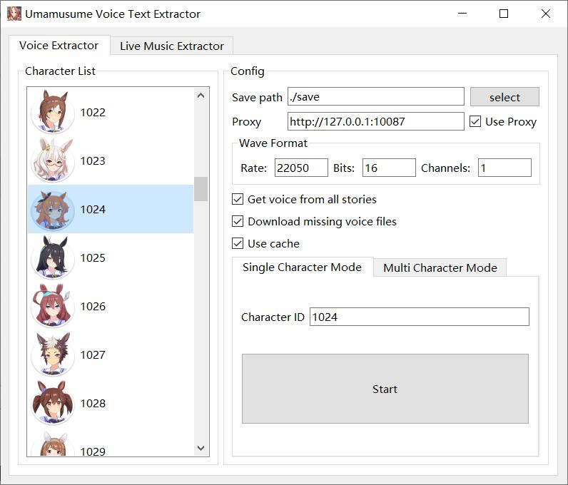
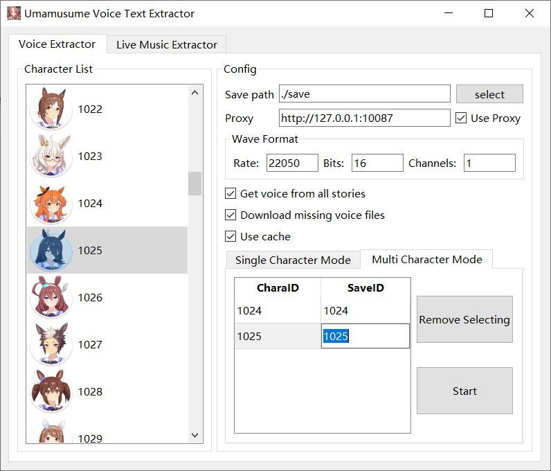
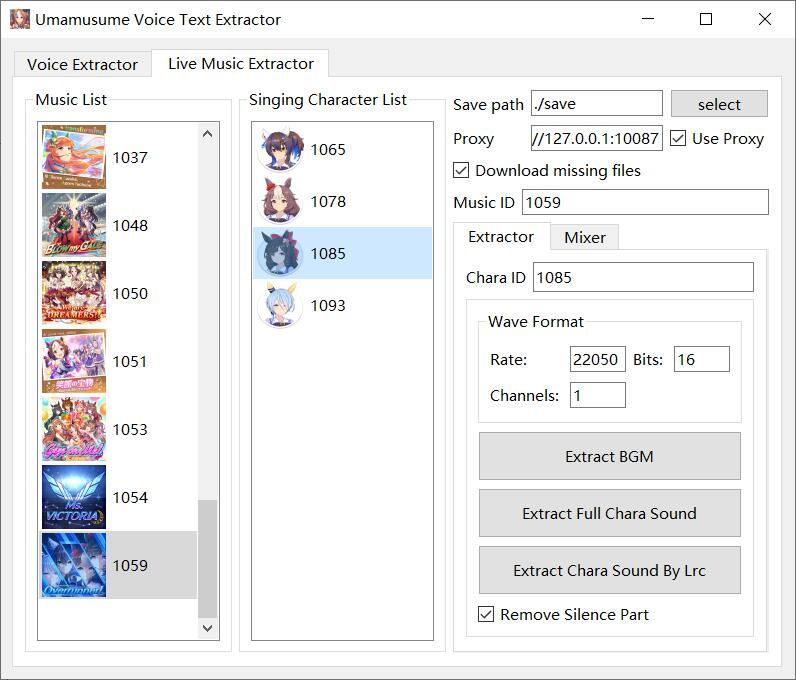
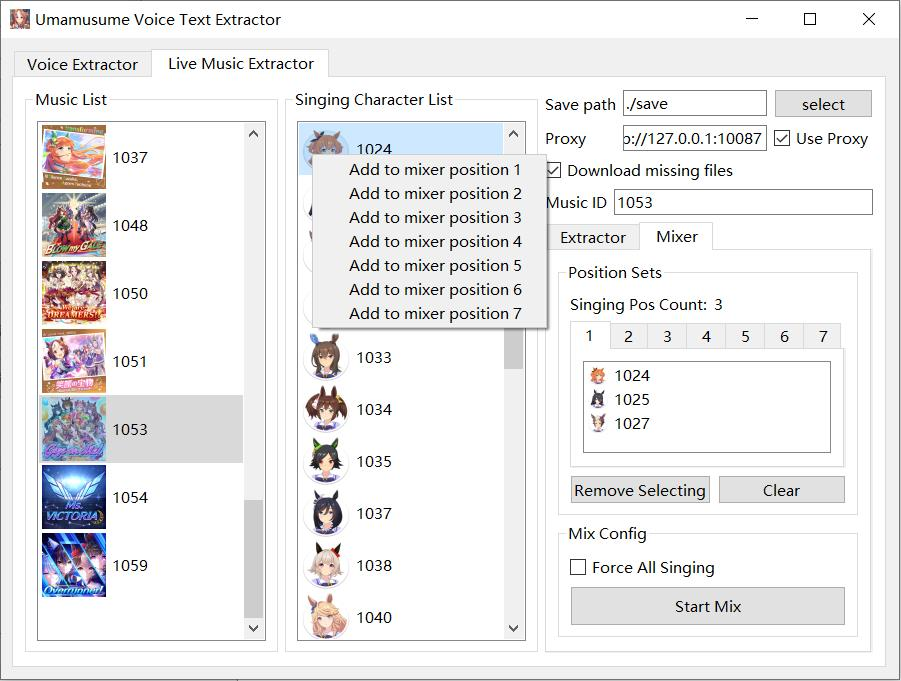
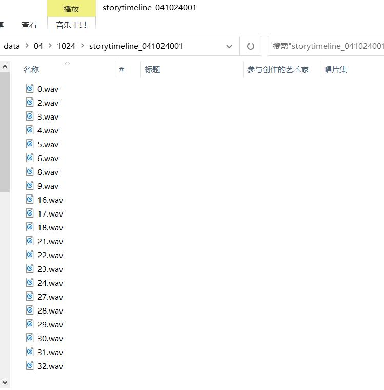
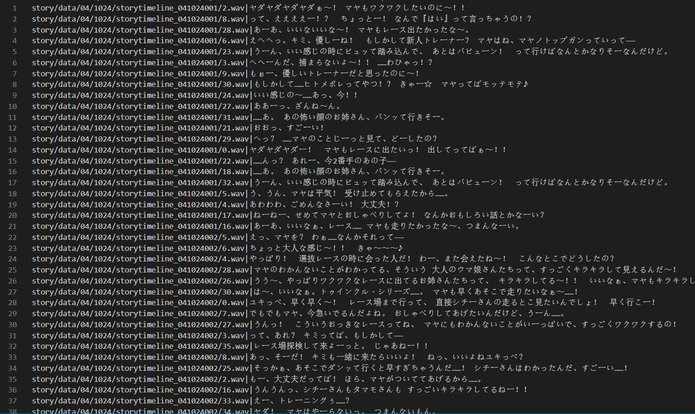
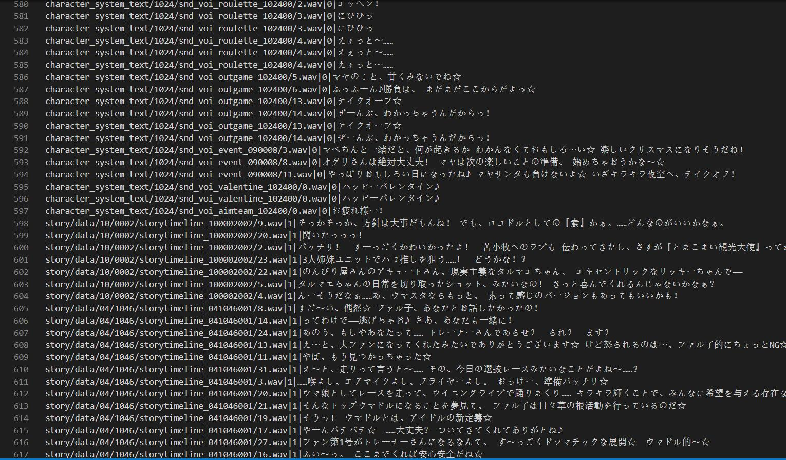

# umamusume-voice-text-extractor

- [Chinese/中文](README-ZH.md)
- Extract the voice and corresponding text


# Install

## Use binary files

- Install [.Net 6.0 Runtime](https://dotnet.microsoft.com/zh-cn/download/dotnet/6.0)

- Download binary file in [Releases](https://github.com/chinosk6/umamusume-voice-text-extractor/releases)
- Double-click `run.bat`


## Run from code

- Required Environment: [Python 3.8+](https://www.python.org/downloads/)、[.Net 6.0 Runtime](https://dotnet.microsoft.com/zh-cn/download/dotnet/6.0)
- Install python package: `pip install -r requirements.txt`

```
pydantic~=1.8.2
colorama~=0.4.4
pythonnet~=3.0.1
UnityPy~=1.9.21
requests~=2.31.0
PyQt5~=5.15.4
rich~=13.5.2
```


# Usage

## With GUI

- Run binary file from [Releases](https://github.com/chinosk6/umamusume-voice-text-extractor/releases) : `run.bat`
- Run source code: `python gui_main.py`
- Empty any of the `Wave Format` sections, the output will follow the original format.


### Extract Single Character

- Extract result example: `xxx/xxx.wav|こんにちは`
- Click the target character, and then click `Start`.<br>


### Extract Multi Characters

- Extract result example: `xxx/xxx.wav|0|こんにちは`
- Double-click the target character to add to the list, you can modify the `SaveID`.<br>


### Live Music Extract

- Click the target music, then click the target character.<br>


### Live Music Mixer

- Right-click on the target character and add it to the target position. Parts greater than `Singing Pos Count` will be ignored.<br>


## No GUI

- Edit and run `main.py`: `python main.py`

```python
import voiceex

# set save folder, download when missing awb/acb files, get voice from all character stories (takes a long time), use cache (Save in "umacache" folder. You need to delete the cache file yourself after the game update.)
ex = voiceex.VoiceEx(save_path="save", download_missing_voice_files=True, get_voice_from_all_stories=False, use_cache=True)

# set wave sampling rate, bits, channels (optional)
ex.set_wav_format(22050, 16, 1)

# set download proxy (optional)
ex.set_proxies("http://127.0.0.1:10087")
```

 - Single Character Mode

```python
# Single Character Mode
# start extract character No.1024 (MayanoTopgun)
ex.extract_all_char_text_single(1024)
```

 - Multi Character Mode

```python
# Multi Character Mode
# Set character output id (Union[int, str])
ex.set_multi_char_out_ids([
    (1024, "0"), (1046, 1)
])
# start extract character No.1024 (MayanoTopgun) and No.1046 (SmartFalcon)
ex.extract_all_char_text_multi([1024, 1046])
```


- The voice-text file is in `{your save_path}/output.txt`.


# Extract Result

 - Voice files


 - Single character mode


 - Multi character mode



# Special Thanks

- [MarshmallowAndroid/UmaMusumeExplorer](https://github.com/MarshmallowAndroid/UmaMusumeExplorer)

